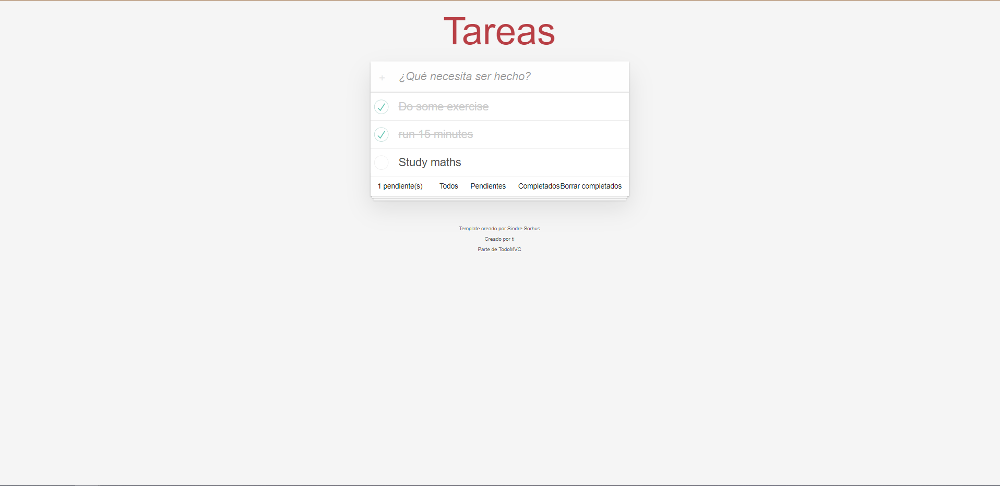

# Todo List - JavaScript App

This project was build using pure JavaScript and Vite for any person who wants to have they own list and do their following.
If you're interested in use or modify this project you'll find the instructions below:

## Develop

1. Install the dependencies `npm install` or `yarn install`
2. Run the project using development mode `npm run dev` or `yarn dev`
3. When you finish and want to create the production package run `npm run build` or `yarn run build`

## Production:

1. Go to the following link: https://diegourrego4.github.io/js-todo-list-vite/ and enjoy the app 😊

# App:

